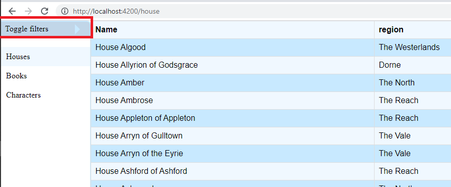
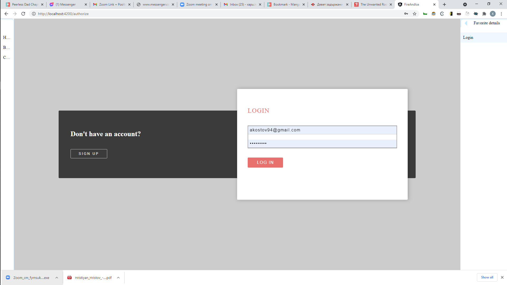
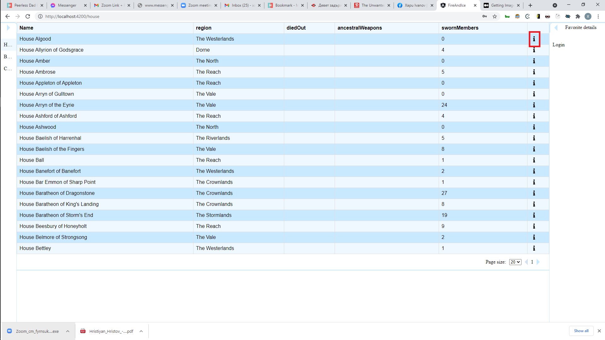
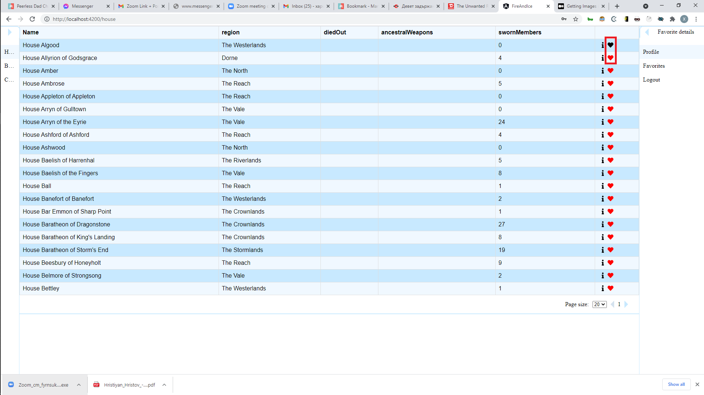

This is project that shows the data exposed by the API `anapioficeandfire`, which can be found here

Run the project:
1. To run this application please install node 12+ on your machine. 
2. Inside the project folder please run `npm install`
3. Inside the project folder please run `ng serve` and open `localhost:4200/`

Features

Non authorized users:

Should be able to browse different entities (books, houses, characters)
Should be able to filter out the entities inside the lists
Should be able to login or register

Authorized users:

Should have all functionalities that non authorized users have
Should be able to logout
Should be able to add entities to favorites
Should have `favorites` options in the sidebar
Should have `favorites` that display all favorites enmities

Flows

### Open filters

### Login

### Go to details

### Add to favorites

### Toggle Favorites

## Comments
* The auth logic is in memory, so the state of user credentials or favorites selection will be lost on refresh

* There are no guards for the routing

* There is a lot of inline CSS that should be moved to the scss files

* The work seen here was done under 10 hours in the time span of 3 days
